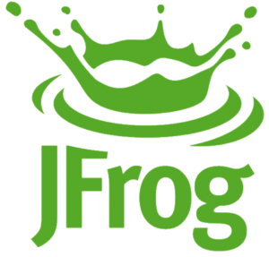

# License Splitter

一个用于解密和分解 JFrog License 文件的 macOS 桌面应用程序。



## 🌟 功能特性

- 🔐 **AES-256-CBC 解密**: 兼容 OpenSSL 的加密算法
- 📄 **许可证分解**: 自动提取并清理许可证密钥
- 📋 **批量操作**: 支持单个或批量复制许可证
- 💾 **结果保存**: 将分解结果保存为文本文件
- 📚 **历史记录**: 自动记录成功的解密历史 (存储在 `~/.license_splitter/history/`)
- 🖱️ **右键菜单**: 便捷的上下文操作
- 🎨 **现代界面**: 基于 PyQt6 的美观用户界面
- 📁 **拖拽支持**: 支持文件拖拽操作

## 📥 下载安装

### 直接下载
下载最新版本的 DMG 文件：[License-Splitter-v1.0.5-final.dmg](./dist/License-Splitter-v1.0.5-final.dmg)

### 安装步骤
1. 双击下载的 `.dmg` 文件
2. 将 `License Splitter.app` 拖拽到 `Applications` 文件夹
3. 在启动台或 Applications 文件夹中启动应用

## 🚀 使用方法

### 基本操作
1. **选择文件**: 点击"浏览"按钮或拖拽加密的 JSON 文件到输入框
2. **输入密码**: 在密码框中输入解密密码
3. **开始分解**: 点击"🚀 开始分解"按钮
4. **查看结果**: 在右侧查看分解出的许可证列表
5. **复制/保存**: 使用"复制全部"或"保存结果"功能

### 高级功能
- **历史记录**: 点击"历史记录"查看之前的解密记录
- **右键菜单**: 在历史记录项上右键可复制或删除
- **单项复制**: 在许可证列表中单击任意项进行单独复制

## 🛠️ 系统要求

- **操作系统**: macOS 10.15 (Catalina) 或更高版本
- **Python**: 3.7+ (通常系统自带)
- **依赖库**: PyQt6, cryptography (应用内已包含)

## 🏗️ 开发构建

### 环境准备
```bash
# 克隆项目
git clone <repository-url>
cd license-decomposer-project

# 创建虚拟环境
python3 -m venv venv
source venv/bin/activate

# 安装依赖
pip install -r requirements.txt
```

### 运行开发版本
```bash
# 激活虚拟环境
source venv/bin/activate

# 启动应用
python3 start_license_splitter.py
```

### 一键构建
```bash
# 使用自动化构建脚本
./build/build.sh
```

详细的构建步骤和手动构建说明，请参考 [build/README.md](./build/README.md)

## 📁 项目结构

```
license-decomposer-project/
├── README.md                     # 项目说明文档
├── requirements.txt              # Python 依赖
├── start_license_splitter.py     # 应用启动入口
├── license_decomposer.py         # 核心解密逻辑
├── gui_app_pyqt.py              # 主界面应用
├── history_manager.py           # 历史记录管理
├── history_widgets.py           # 历史记录界面组件
├── icon_manager.py              # 图标管理
├── icons/                       # 应用图标资源
├── jfrog_icon.icns             # macOS 图标文件
├── docs/
│   └── USER_GUIDE.md            # 用户使用手册
├── build/                       # 构建脚本和配置
│   ├── build.sh                 # 一键构建脚本
│   ├── README.md                # 详细构建说明
│   ├── Info.plist.template      # 配置模板
│   └── launcher.sh.template     # 启动脚本模板
└── dist/                        # 构建产物目录
    ├── License Splitter.app     # macOS 应用包
    ├── License-Splitter-v1.0.5-final.dmg  # 安装程序
    └── README.md                # 构建产物说明
```

## 🔧 技术实现

### 核心技术
- **GUI 框架**: PyQt6
- **加密库**: Python cryptography
- **密钥派生**: 兼容 OpenSSL EVP_BytesToKey 算法
- **应用打包**: 手工制作 macOS 应用包

### 安全特性
- 支持 AES-256-CBC 解密
- 兼容 OpenSSL 的 Salted__ 格式
- 多种字符编码尝试 (UTF-8, Latin-1, CP1252)
- 安全的密码存储 (Base64 编码)

## 📝 更新日志

### v1.0.5 (2025-07-31)
- 🐛 修复右键菜单在 PyQt6 中的兼容性问题
- 🧹 清理调试代码，优化性能
- 🔧 完善异常处理机制
- 📦 优化应用包体积

### v1.0.4 及之前版本
- ✨ 实现核心许可证解密功能
- �� 添加历史记录管理系统
- 🎨 优化用户界面体验
- 📁 支持文件拖拽操作
- 🖱️ 添加右键上下文菜单

## 🤝 贡献指南

欢迎提交 Issue 和 Pull Request！

### 开发规范
遵循 PEP 8 代码风格，添加适当注释，测试新功能

## 📄 许可证

本项目采用 MIT 许可证，详见 [LICENSE](./LICENSE) 文件。

## 📞 支持与反馈

如有问题或建议，请提交 GitHub Issue

---

**License Splitter** - 让许可证管理变得简单高效！
