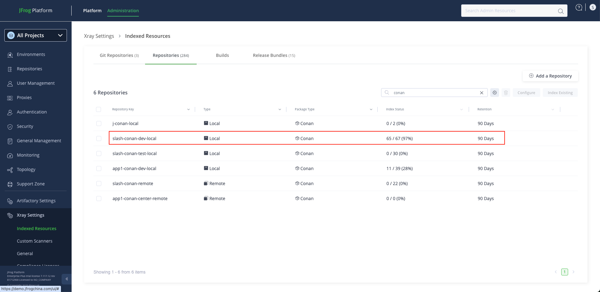
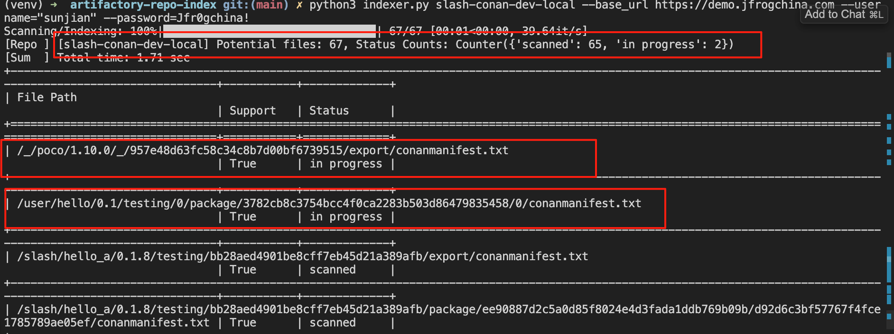

# Artifactory Repository Indexer

## 概述

该项目是一个Python脚本，用于对JFrog Xray的 **Indexed Resources** 的数据进行解释。
支持并发API调用，结果可以保存为CSV、JSON或表格格式。

## 具体功能

### 核心功能模块

1. **仓库索引扫描** - 扫描Artifactory仓库中的制品索引状态
2. **扫描状态分析** - 分析每个制品的扫描状态（scanned、failed、not scanned等）
3. **并发API调用** - 支持多线程并发处理，提高扫描效率
4. **包类型支持检查** - 根据配置文件检查制品是否被Xray支持
5. **强制重新索引** - 可选择强制重新索引制品
6. **多格式输出** - 支持table、CSV、JSON三种输出格式

### 使用场景

- 运维人员检查仓库扫描状态
- 识别扫描失败的制品
- 批量分析仓库健康状态
- 生成扫描状态报告
- 强制重新索引相关制品

## 功能演示

### 问题展示: 显示未100%，但不确定具体的文件是哪个(也存在特殊情况,如: 虽然显示100%, 但是仓库中的部分制品可能没有扫描结果)



*图一：UI显示65/67的扫描进度，其中67为应扫描文件总数，65为成功扫描的文件数*

### 扫描结果解答



*图二：显示扫描状态统计，包括成功扫描65个文件，2个文件正在扫描中（in progress），可以精确定位到具体文件路径*

> **重要提示**: 此脚本主要用于帮助定位"相关文件"和扫描状态，至于具体的扫描错误问题可以联系 JFrog Support 处理。

## 相关数值对应的定义和澄清

### 扫描状态
[官方说明](https://jfrog.com/help/r/xray-rest-apis/scan-status)中,有以下几种状态：
```shell
{
"status": "failed"/"not supported"/"in progress"/"not scanned"/"scanned"
}
```

> **注意**: 在Xray一些版本中可能存在其他的状态，如scan failed、或者接口返回500报错等情况。

**对几种状态的通俗解释:**

| 状态 | 说明 | 处理建议 |
|------|------|----------|
| `not supported` | 此仓库不支持此制品类型，比如在nuget仓库中上传的dll文件 | 检查制品类型是否与仓库匹配 |
| `not scanned` | 未扫描，通常出现在制品刚上传阶段或扫描结果已过期（默认保留90天） | 等待扫描完成或手动触发扫描 |
| `in progress` | 扫描进行中，如果长时间保持此状态需要排查原因 | 检查Xray服务状态，必要时联系支持 |
| `scanned` | 扫描成功，制品已通过安全检查 | 正常状态，无需处理 |
| `failed/scan failed` | 扫描失败，需要分析具体原因 | 查看日志，联系JFrog Support |

## 安装

### 环境要求
- **Python版本**: 3.7+
- **操作系统**: Linux, macOS, Windows
- **网络**: 需要访问JFrog Artifactory实例

### 环境准备

```bash
# 1. 创建Python虚拟环境
python3 -m venv venv

# 2. 激活虚拟环境
source venv/bin/activate  # Linux/macOS
# 或者 Windows: venv\Scripts\activate

# 3. 安装依赖包（推荐）
pip install -r requirements.txt

# 或者手动安装核心依赖
pip install requests tqdm wcwidth tabulate

# 4. 验证安装
python3 indexer.py --help
```

## 项目结构

- **`indexer.py`** - 主脚本文件
- **`Xray_pkg_support.json`** - 文件类型的支持规则
- **`requirements.txt`** - Python依赖包列表
- **`README.md`** - 项目说明文档

## 🚀 快速开始

### 基本使用流程
```bash
# 1. 克隆项目
git clone https://github.com/jfrogchina/MaintainenceTools.git
cd MaintainenceTools/xray-indexed-resource-status-list

# 2. 设置环境
python3 -m venv venv
source venv/bin/activate
pip install -r requirements.txt

# 3. 运行扫描
python3 indexer.py my-repo --base_url=https://myjfrogurl.com --username myuser --password mypass
```

## 使用方法

### 命令行参数

| 参数 | 说明 | 默认值 |
|------|------|--------|
| `reponame` | 仓库的名称 | **必需** |
| `--base_url` | Artifactory实例的基本URL | `http://localhost:8082` |
| `--pkg_support` | 包支持规则文件 | `Xray_pkg_support.json` |
| `--username` | Artifactory用户名 | `admin` |
| `--password` | Artifactory密码 | `password` |
| `--scan_result_save` | 保存扫描结果的文件 | `scan_details.file` |
| `--print_lines` | 在控制台打印的行数 | `10` |
| `--format` | 数据格式: `table` \| `json` \| `csv` | `table` |
| `--clear_log` | 是否清空日志 | `True` |
| `--threads` | 并发API调用的线程数 | `50` |
| `--forcereindex` | 强制重新索引每个制品后再扫描 | `False` |

### 运行示例

1. **基本扫描**：
    ```bash
    python3 indexer.py my-repo --base_url=https://myjfrogurl.com --username myuser --password mypass --scan_result_save results.csv --format csv
    ```

2. **强制重新索引后扫描**：
    ```bash
    python3 indexer.py my-repo --base_url=https://myjfrogurl.com --username myuser --password mypass --forcereindex
    ```

2. **运行说明**
    - 脚本会扫描指定的仓库 `my-repo`
    - 结果将保存为CSV格式到 `results.csv` 文件
    - 支持多种输出格式：`table`、`json`、`csv`

### 日志记录

日志记录保存在 `scan_details.file`（默认）文件中，可以根据需要使用 `--scan_result_save` 参数更改文件名。


## 特殊情况

> **注意**: 极少数情况下，可能会遇到脚本返回的数字与UI页面上展示的不一样的问题，通常可能是由于特殊包或垃圾数据导致的，具体情况需要具体分析。

**重要声明**: 此脚本主要用于找到"问题文件"和定位扫描状态，其他问题需要具体排查和解决。

## 贡献

欢迎贡献！请 fork 本仓库并提交 PR。

## 许可证


