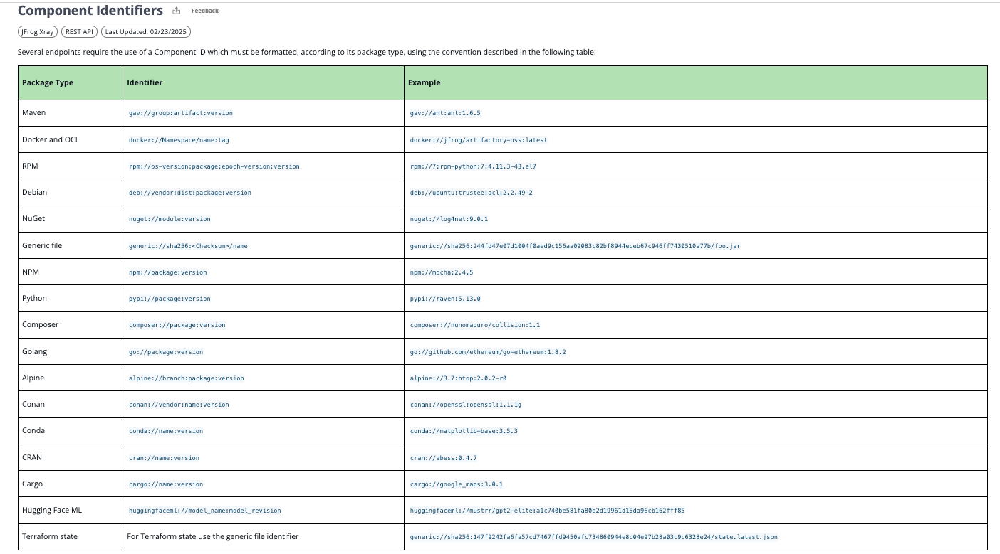

# Xray Repository Configuration Checker

JFrog Xray仓库配置检查工具

## 功能描述

检查JFrog仓库的JAS配置状态，包括：
- **漏洞上下文分析** (Vulnerability Contextual Analysis)
- **暴露扫描** (Exposures)
- **仓库保留策略** (Retention Policy)

## 使用方法

### 环境配置
```bash
python3 -m venv venv
source venv/bin/activate
# 安装依赖
pip install requests
```

### 配置认证信息
# 修改脚本中的 USERNAME 和 PASSWORD
```sh
XRAy_API_URL=
USERNAME=
PASSWORD=
```

### 配置想要查询的仓库
```sh
# xray-repo-configuration-check.py # main() :
    type_filters = ["local", "remote"] # 可同时配置多个
    pkg_type_filters = ["Docker", "Maven"] # 可同时配置多个
```

### 运行脚本
```bash
python3 xray-repo-configuration-check.py
```

## 输出示例

```
repo_name                                        retention vuln_contextual_analysis exposures    
zhl-maven-test-rep-local                         90        True                     {'scanners_category': {'secrets_scan': True}}
zhl-pypi-pytorch                                 90        False                    {'scanners_category': {'secrets_scan': True, 'applications_scan': True}}
zhl-test-maven                                   90        True                     {'scanners_category': {'secrets_scan': True}}
```

## 支持的功能

### 漏洞上下文分析
- **支持仓库类型**: Docker, Maven, Gradle, npm
- **功能**: 提供更准确的漏洞评估和修复建议

### 暴露扫描
- **支持包类型**: Docker, OCI, Maven, npm, Pypi
- **功能**: 检测制品中的敏感信息暴露

## 配置说明

>支持以下包类型(Package Type)：
https://jfrog.com/help/r/xray-rest-apis/component-identifiers


## 注意事项

- 需要JFrog Xray API访问权限
- 建议在生产环境使用API密钥而非密码
- 输出结果按仓库名称字母顺序排序 